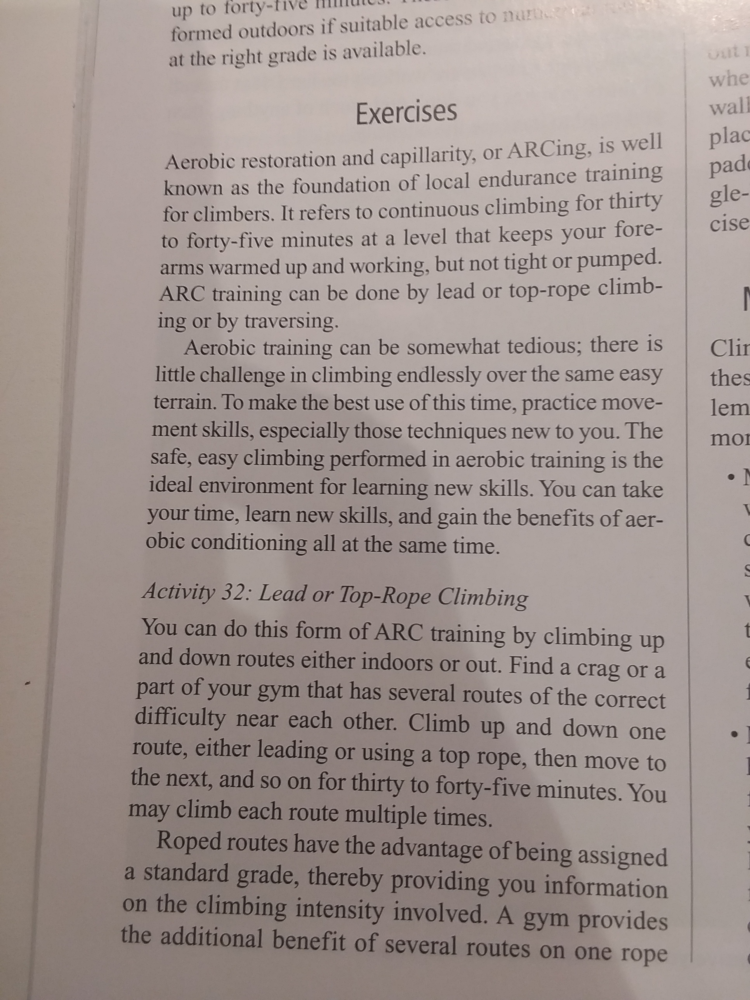

*31 Jan 2019*

# Training

Until recently I thought that training for climbing was lame. I dislike taking shortcuts, and hated that doing isolated workouts could substitute for good movement and mental skills. It felt too goal-oriented for something I wanted to keep pure and simple and fun.

I've matured. Although I think these pitfalls still exist, I now consider building fitness an essential component of climbing. My reasons:

1. I've realized that fitness is correlated to, not independent from, movement and the mental game. Quite simply, being fit makes climbing feel better as a whole. Fitness enhances, not replaces, fundamental skills.
2. Despite appearances, training is a nuanced and creative practice. There is no single optimal training plan, and it is rewarding to balance and specialize your training to match your personal goals. And then to reach them.
3. Training makes you focus on a single, constrained, hard, painful task, which alone might capture the essence of climbing.
4. I believe that it's important to try hard and improve at the things you spend time on. Training is effective for improving your climbing and should be taken seriously.

## My approach

Right now, I take a freer approach to training: not scheduling workouts, diversifying my exercises, and experimenting a lot. I like this approach because it keeps every session fresh and fun to do. I think that letting exercises lay fallow also helps flush bad habits and reduces the chance of overuse injuries.

I try to optimize for the time and quality of my workouts. I don't want to spend ages in the gym, and the fact that a lot of exercises are high-intensity complements this nicely. I've started to realize that the effort you put into each workout – maintaining good technique and trying hard on each set – is more important than how much you exercise. Consistency is still important though.

Fitness can be easily understood by categorizing it. For climbing, the main areas of fitness are:

1. **Strength:** how hard you can pull and hold on to bad holds
2. **Power:** how hard you can quickly pull up from a hold or how effectively you can quickly grab and hang on to a bad hold (like in a deadpoint)
3. **Aerobic endurance:** how long or intensely you can climb before feeling a pump
4. **Anaerobic endurance:** how long or intensely you can climb once you start feeling a pump until you reach muscular failure
5. Everything else (stamina, core strength, antagonistic strength, flexibility)

*These categories pretty much all refer to the muscles and tendons in the fingers, forearms, and arms, since these are usually the limiting factors in climbing.*

When you view fitness this way and then establish good short-term goals right above your limit, it makes choosing workouts really easy. A simple process:

1) Make a relatively specific goal. This can be based off a specific project, a known weakness, or something that you're excited about improving.

*I want to get my [lead climbing level up to my bouldering level](https://www.mec.ca/en/explore/climbing-grade-conversion). I usually fall off before the crux or am too tired by the time I get to it.*

2) Identify the area(s) that is holding you back.

*I need to increase my aerobic endurance in order to make it through sustained sections.*

3) Choose workouts targeting that area.

*I'll do ARCing exercises a couple times a week to build up my aerobic endurance. I'll also mix in 4x4s to improve my anaerobic endurance and to get me through the pumpy cruxes.*

## Workouts

### 1) Strength

#### Hangboarding

This is the climber's bread and butter workout. It's the most efficient way to improve climbing across all disciplines.

<iframe width="560" height="315" src="https://www.youtube.com/embed/VeKE5VH5-qg" frameborder="0" allow="accelerometer; autoplay; encrypted-media; gyroscope; picture-in-picture" allowfullscreen></iframe>

#### Threshold Bouldering

<iframe width="560" height="315" src="https://www.youtube.com/embed/sKzDko8DVDw" frameborder="0" allow="accelerometer; autoplay; encrypted-media; gyroscope; picture-in-picture" allowfullscreen></iframe>

### 2) Power

*WIP*

### 3) Aerobic Endurance

#### ARCing

### 4) Anaerobic Endurance

#### 4x4s

### 5) Stamina

*WIP*

### 6) Core Strength

*WIP*

### 7) Antagonistic Strength

*WIP*

### 8) Flexibility

*WIP*

